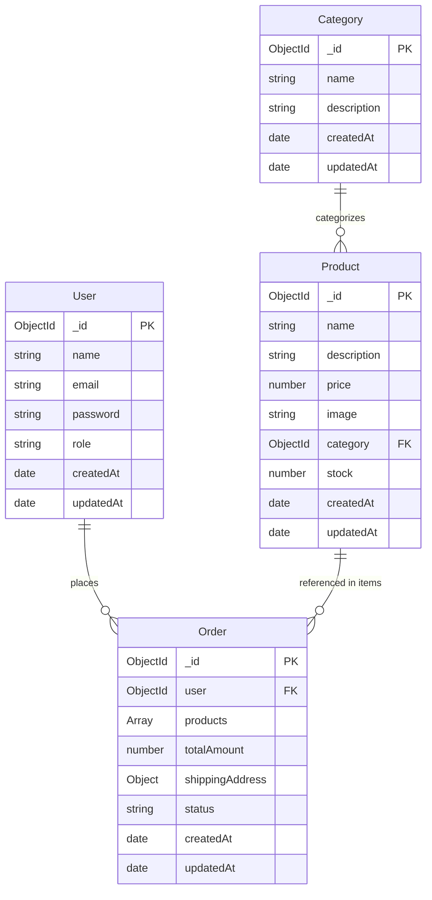

# 🗄 Database Design & Data Modeling Specification

This document details the MongoDB schema definitions, constraints, relationships, indexes, and sample JSON payloads for the **MERN Mini E-Commerce Application**.

Per project specifications, exactly **four models** are defined:
1. `User`
2. `Category`
3. `Product`
4. `Order`

---

## 1. Entity-Relationship Overview



---

## 2. Model Specifications

### 2.1 User Model

Stores both customer and administrator credentials and profile data.

#### Schema Definition

| Field Name | Type | Required | Constraints / Defaults | Description |
| :--- | :--- | :--- | :--- | :--- |
| `_id` | `ObjectId` | Auto | Generated by MongoDB | Unique primary identifier |
| `name` | `String` | Yes | `trim: true`, `maxlength: 100` | Full name of the user |
| `email` | `String` | Yes | `unique: true`, `lowercase: true`, `trim: true` | Validated email address for login |
| `password` | `String` | Yes | `minlength: 6` | Bcrypt password hash (salt rounds = 10) |
| `role` | `String` | Yes | `enum: ['customer', 'admin']`, default: `'customer'` | Access control role |
| `createdAt` | `Date` | Auto | Timestamp | Account creation timestamp |
| `updatedAt` | `Date` | Auto | Timestamp | Account last update timestamp |

#### Indexes
- `{ email: 1 }` (Unique index for fast lookup during login/registration)

#### Sample Document (JSON)
```json
{
  "_id": "651f8a1c9e8b1a2b3c4d5e01",
  "name": "Jane Doe",
  "email": "jane.doe@example.com",
  "password": "$2a$10$e7K4b.dF5qL5A/t9UuA9Me7hYQ6R6sK91ZkQx7Y7v6UeP2C2V1qre",
  "role": "customer",
  "createdAt": "2026-10-02T10:00:00.000Z",
  "updatedAt": "2026-10-02T10:00:00.000Z"
}
```

---

### 2.2 Category Model

Organizes products into navigable catalogs (e.g., Electronics, Fashion, Shoes).

#### Schema Definition

| Field Name | Type | Required | Constraints / Defaults | Description |
| :--- | :--- | :--- | :--- | :--- |
| `_id` | `ObjectId` | Auto | Generated by MongoDB | Unique primary identifier |
| `name` | `String` | Yes | `unique: true`, `trim: true`, `maxlength: 50` | Unique category name |
| `description` | `String` | No | `trim: true`, `maxlength: 250`, default: `""` | Brief category description |
| `createdAt` | `Date` | Auto | Timestamp | Category creation timestamp |
| `updatedAt` | `Date` | Auto | Timestamp | Category last update timestamp |

#### Indexes
- `{ name: 1 }` (Unique index to prevent duplicate category names)

#### Sample Document (JSON)
```json
{
  "_id": "651f8a1c9e8b1a2b3c4d5e10",
  "name": "Electronics",
  "description": "Smartphones, audio, and personal gadgets",
  "createdAt": "2026-10-02T10:05:00.000Z",
  "updatedAt": "2026-10-02T10:05:00.000Z"
}
```

---

### 2.3 Product Model

Stores item inventory, pricing, imagery, and category association.

#### Schema Definition

| Field Name | Type | Required | Constraints / Defaults | Description |
| :--- | :--- | :--- | :--- | :--- |
| `_id` | `ObjectId` | Auto | Generated by MongoDB | Unique primary identifier |
| `name` | `String` | Yes | `trim: true`, `maxlength: 150` | Product display name |
| `description` | `String` | Yes | `trim: true`, `maxlength: 2000` | Detailed product overview |
| `price` | `Number` | Yes | `min: 0.01` | Positive unit price in currency units |
| `image` | `String` | Yes | `trim: true` | URL or relative path to product image |
| `category` | `ObjectId` | Yes | `ref: 'Category'` | Reference to parent Category |
| `stock` | `Number` | Yes | `min: 0`, `default: 0`, integer | Available inventory balance |
| `createdAt` | `Date` | Auto | Timestamp | Product creation timestamp |
| `updatedAt` | `Date` | Auto | Timestamp | Product last update timestamp |

#### Indexes
- `{ category: 1 }` (Accelerates filtering by category)
- `{ name: "text", description: "text" }` (Full-text search index for keyword queries)

#### Sample Document (JSON)
```json
{
  "_id": "651f8a1c9e8b1a2b3c4d5e20",
  "name": "Wireless Noise Cancelling Headphones",
  "description": "Over-ear bluetooth headphones with 40-hour battery life and fast USB-C charging.",
  "price": 99.99,
  "image": "https://images.unsplash.com/photo-1505740420928-5e560c06d30e?w=600",
  "category": "651f8a1c9e8b1a2b3c4d5e10",
  "stock": 25,
  "createdAt": "2026-10-02T10:10:00.000Z",
  "updatedAt": "2026-10-02T10:10:00.000Z"
}
```

---

### 2.4 Order Model

Represents confirmed purchases, item snapshots at time of order, delivery addresses, and fulfillment status.

#### Schema Definition

| Field Name | Type | Required | Constraints / Defaults | Description |
| :--- | :--- | :--- | :--- | :--- |
| `_id` | `ObjectId` | Auto | Generated by MongoDB | Unique primary identifier |
| `user` | `ObjectId` | Yes | `ref: 'User'` | Customer who placed the order |
| `products` | `Array` | Yes | Minimum 1 item | Ordered items with snapshot data |
| `products.$.product` | `ObjectId` | Yes | `ref: 'Product'` | Referenced product |
| `products.$.name` | `String` | Yes | `trim: true` | Product name snapshot |
| `products.$.price` | `Number` | Yes | `min: 0.01` | Price snapshot at time of checkout |
| `products.$.quantity` | `Number` | Yes | `min: 1` | Purchased item quantity |
| `totalAmount` | `Number` | Yes | `min: 0` | Authoritative order total calculated on backend |
| `shippingAddress` | `Object` | Yes | Sub-document | Customer delivery destination |
| `shippingAddress.name` | `String` | Yes | `trim: true` | Recipient full name |
| `shippingAddress.phone` | `String` | Yes | `trim: true` | Contact phone number |
| `shippingAddress.address` | `String` | Yes | `trim: true` | Street address / apartment |
| `shippingAddress.city` | `String` | Yes | `trim: true` | Delivery city |
| `shippingAddress.pincode` | `String` | Yes | `trim: true` | Postal / PIN code |
| `paymentMethod` | `String` | Yes | `default: 'Cash on Delivery'` | Payment mode (COD only) |
| `status` | `String` | Yes | `enum: ['Pending', 'Confirmed', 'Shipped', 'Delivered', 'Cancelled']`, default: `'Pending'` | Current order status |
| `createdAt` | `Date` | Auto | Timestamp | Order placement timestamp |
| `updatedAt` | `Date` | Auto | Timestamp | Status update timestamp |

#### Indexes
- `{ user: 1, createdAt: -1 }` (Optimizes fetching "My Orders" in reverse chronological order)
- `{ status: 1 }` (Optimizes admin filtering by order status)

#### Sample Document (JSON)
```json
{
  "_id": "651f8a1c9e8b1a2b3c4d5e30",
  "user": "651f8a1c9e8b1a2b3c4d5e01",
  "products": [
    {
      "product": "651f8a1c9e8b1a2b3c4d5e20",
      "name": "Wireless Noise Cancelling Headphones",
      "price": 99.99,
      "quantity": 2
    }
  ],
  "totalAmount": 199.98,
  "shippingAddress": {
    "name": "Jane Doe",
    "phone": "+1 (555) 234-5678",
    "address": "456 Market Street, Apt 12B",
    "city": "San Francisco",
    "pincode": "94105"
  },
  "paymentMethod": "Cash on Delivery",
  "status": "Pending",
  "createdAt": "2026-10-02T10:30:00.000Z",
  "updatedAt": "2026-10-02T10:30:00.000Z"
}
```

---

## 3. Data Integrity & Validation Constraints

1. **Email Uniqueness & Normalization**: User emails are automatically lowercased and stripped of whitespace before being indexed and saved.
2. **Stock Bounds**: The `Product.stock` field enforces `min: 0`. Any decrement resulting in a negative integer is rejected by Mongoose validation.
3. **Price Non-Negotiation**: Order item prices are snapshotted from the database record during the `orderController` execution; any client-provided price parameter is discarded.
4. **Referential Validity**: Before creating a product, the backend verifies that the specified `category` ID exists in the database.
