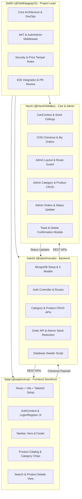

# 👥 Team Task Distribution & GitHub Issues Breakdown

This document details the task assignments, feature scopes, and tracking issues created for all **4 team members** on the **MERN Mini E-Commerce Project**.

---

## 1. Team Roster & Assigned Issues

| Team Member | GitHub Username | Role / Responsibility | GitHub Issue | Status |
| :--- | :--- | :--- | :---: | :---: |
| **Siddhi Jagtap** | [`@Siddhijagtap23`](https://github.com/Siddhijagtap23) | **Project Lead**, Core Architecture, Security & E2E Integration | [**Issue #4**](https://github.com/Siddhijagtap23/E-com/issues/4) | Assigned |
| **Sakshi Vavale** | [`@sakshivavale`](https://github.com/sakshivavale) | **Backend Lead**, MongoDB Models & REST APIs | [**Issue #1**](https://github.com/Siddhijagtap23/E-com/issues/1) | Assigned |
| **Sejal** | [`@sejalnverse`](https://github.com/sejalnverse) | **Frontend Lead**, Public Storefront, Catalog & Product Discovery | [**Issue #2**](https://github.com/Siddhijagtap23/E-com/issues/2) | Assigned |
| **Harsh Walke** | [`@HarshSWalke`](https://github.com/HarshSWalke) | **Admin & Cart Lead**, Cart, Checkout, Order Tracking & Admin Panel | [**Issue #3**](https://github.com/Siddhijagtap23/E-com/issues/3) | Assigned* |

> *\*Note for Harsh: Once the pending collaboration invitation is accepted at [https://github.com/Siddhijagtap23/E-com/invitations](https://github.com/Siddhijagtap23/E-com/invitations), GitHub will automatically show you under the official Assignees list on Issue #3.*

---

## 2. Detailed Responsibility Matrix

---

## 3. Task Breakdown by Member

### 1. Siddhi Jagtap — Issue #4: Core Architecture, Security & E2E Integration
- **Direct Link**: [Issue #4: `[Lead] Core Architecture, Security Middlewares & E2E Integration (Siddhi)`](https://github.com/Siddhijagtap23/E-com/issues/4)
- **Key Responsibilities**:
  1. Base environment configuration (`/server` and `/client` configurations).
  2. Implement central JWT generation (`generateToken.js`).
  3. Implement `authMiddleware.js` and `adminMiddleware.js`.
  4. Enforce server-side security rules: authoritative prices in order creation; atomic stock reduction.
  5. Configure CORS and Axios interceptor for JWT bearer tokens.
  6. Coordinate PR merges and conduct 10-step End-to-End Demo flow verification.
- **Reference Docs**: [`docs/ARCHITECTURE.md`](./ARCHITECTURE.md), [`docs/SETUP_AND_DEPLOYMENT.md`](./SETUP_AND_DEPLOYMENT.md).

---

### 2. Sakshi Vavale — Issue #1: Backend Architecture, MongoDB Models & REST APIs
- **Direct Link**: [Issue #1: `[Backend] Architecture, MongoDB Models & REST APIs (Sakshi)`](https://github.com/Siddhijagtap23/E-com/issues/1)
- **Key Responsibilities**:
  1. Setup Express server and connect to MongoDB via Mongoose (`config/db.js`).
  2. Define only the 4 required models: `User`, `Category`, `Product`, `Order`.
  3. Implement Auth APIs (`/api/auth/register`, `/api/auth/login`) with bcrypt password hashing (10 rounds).
  4. Implement Category CRUD APIs (`GET`, `POST`, `PUT`, `DELETE /api/categories`).
  5. Implement Product CRUD APIs (`GET`, `GET :id`, `POST`, `PUT`, `DELETE /api/products`) with query filters (`?category=` and `?search=`).
  6. Implement Order APIs (`POST /api/orders`, `GET /api/orders/my-orders`, `GET /api/admin/orders`, `PATCH /api/admin/orders/:id/status`).
  7. Implement database seeder script (`npm run seed`) with default admin and initial categories.
- **Reference Docs**: [`docs/DATABASE_DESIGN.md`](./DATABASE_DESIGN.md), [`docs/API_DOCUMENTATION.md`](./API_DOCUMENTATION.md).

---

### 3. Sejal — Issue #2: Frontend Public Storefront, Catalog & Product Discovery
- **Direct Link**: [Issue #2: `[Frontend] Public Storefront, Catalog & Product Discovery (Sejal)`](https://github.com/Siddhijagtap23/E-com/issues/2)
- **Key Responsibilities**:
  1. React 18 + Vite project initialization with Tailwind CSS.
  2. Setup `AuthContext.jsx` and customer auth views (`/login`, `/register`).
  3. Responsive Navbar (brand logo, links, dynamic cart badge, profile/logout) and modern Footer.
  4. Home Page (`/`) with Hero banner and category links.
  5. Product Catalog (`/products`):
     - Category filter chips: `All | Electronics | Fashion | Shoes`.
     - Real-time / debounced search bar.
     - Responsive product grid with images, prices, and stock indicators.
     - Loading skeleton states and empty state messages.
  6. Product Details view (`/products/:id`) with quantity picker and stock checks.
- **Reference Docs**: [`docs/USER_WORKFLOW.md`](./USER_WORKFLOW.md), [`docs/API_DOCUMENTATION.md`](./API_DOCUMENTATION.md).

---

### 4. Harsh Walke — Issue #3: Cart, Checkout, Order Tracking & Admin Panel
- **Direct Link**: [Issue #3: `[Admin & Cart] Cart, Checkout, Order Tracking & Admin Panel (Harsh)`](https://github.com/Siddhijagtap23/E-com/issues/3)
- **Key Responsibilities**:
  1. `CartContext.jsx` with real-time stock ceiling limit enforcement (`max = product.stock`).
  2. Shopping Cart Page (`/cart`) with quantity adjustment, item removal, and subtotal calculation.
  3. Single-step Cash on Delivery Checkout Page (`/checkout`) with address inputs.
  4. "My Orders" customer tracking page (`/my-orders`).
  5. Admin Dashboard layout with responsive sidebar and route guard (`role === 'admin'`).
  6. Admin Category Management CRUD (table, add/edit/delete modals).
  7. Admin Product Management CRUD (table with stock badges, add/edit/delete modals).
  8. Admin Orders Management (order list, details modal, status updater: `Pending` ➔ `Confirmed` ➔ `Shipped` ➔ `Delivered` / `Cancelled`).
  9. Shared UI components: Toast notifications, delete confirmation dialogs, loading skeletons.
- **Reference Docs**: [`docs/ADMIN_GUIDE.md`](./ADMIN_GUIDE.md), [`docs/USER_WORKFLOW.md`](./USER_WORKFLOW.md).

---

## 4. Collaboration Guidelines

1. **Feature Branching**:
   - Each member should create a feature branch off `main`:
     - Sakshi: `feature/backend-api`
     - Sejal: `feature/storefront-ui`
     - Harsh: `feature/cart-admin`
     - Siddhi: `feature/core-security`
2. **Commit Conventions**:
   - Use conventional commit prefixes: `feat:`, `fix:`, `docs:`, `style:`, `refactor:` (see [`CONTRIBUTING.md`](../CONTRIBUTING.md)).
3. **Pull Requests**:
   - Submit PRs against `main` referencing your issue number (e.g. `Resolves #1`).
   - Siddhi will review and merge PRs to keep the codebase stable and cohesive.
